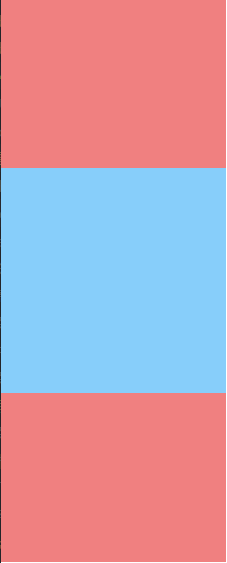

# css-layout

**布局简单来说就是HTML页面的整体结构或骨架，类似于传统的报纸或杂志中的排版，布局不是某个技术，而是一种设计思想。良好的布局不仅使得页面美观大方，而且增加了后期代码的可维护性。**

---

常用css布局方案整理：

1、水平居中布局

2、垂直居中布局

3、居中（水平+垂直）布局

4、两列布局

5、三列布局

6、圣杯布局

7、双飞翼布局

8、等分布局

9、等高布局

10、CSS3多列布局

11、全屏布局

12、rem布局